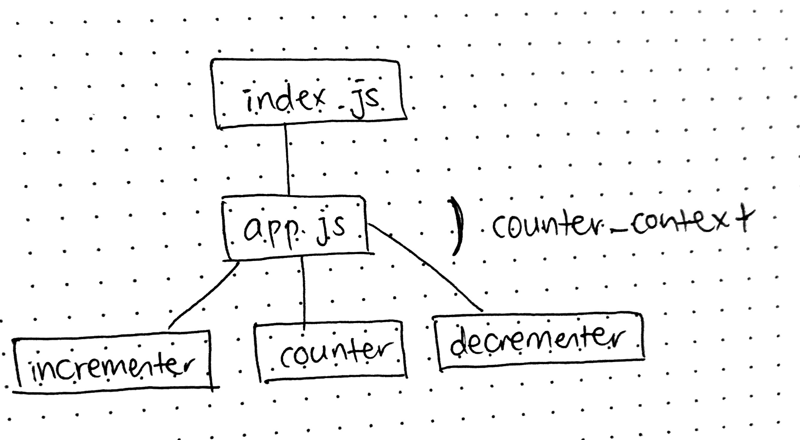

# LAB - 33

## Context API

### Author: Joanna Arroyo

### Links and Resources
* [submission PR](https://github.com/joanna-401-advanced-javascript/lab-33-context-api/pull/1)
* [travis](https://travis-ci.com/joanna-401-advanced-javascript/lab-33-context-api)

#### Documentation
* [styleguide](http://xyz.com)

### Modules
#### `index.js` `app.js` `counter.js` `counter-context.js` `incrementer.js` `decrementer.js` `setupTests.js`

##### Exported Values and Methods
###### `app.js -> React class component`
###### `counter.js -> React class component`
###### `incrementer.js -> React functional component`
###### `decrementer.js -> React functional component`
###### `counter-context.js -> React provider context component`

### Setup
#### Running the app
* `npm start`
  
#### Tests
* Unit tests: `npm run test`
* Lint tests: `npm run lint`

#### UML
